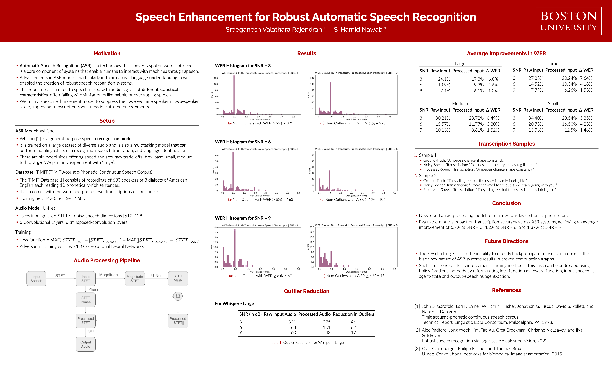

# Speech Enhancement for Robust Automatic Speech Recognition 



## Overview
In this project, we present a audio-enhancement model to improve transcription accuracy in audio-inputs containing multiple speakers.  We train a U-Net network with a custom composite loss-function in an adversarial training paradigm, to suppress lower-volume speakers and maintain higher-volume speakers when fed inputs containing overlapped speech. We present the improvements in the ASR systems with the addition of this model in the processing pipeline.

## Setup

### Dataset Setup
The dataset must be present locally. And the training and inference script will run as long as the absolute path to the training-directory and test-directory are explicitly provided in *fFetchListOfTrainTestFiles()*. 

### Conda Setup
First recreate the conda environment using 
```
conda env create -f environment.yml
```

### Whisper Setup
The ASR system we're using for this project is Whisper \cite{whisper}. When we're instantiating the model, in addition to choosing the model, we also get to decide where the model must be saved. It is good practice to explicitly choose where the models are saved as this enables successul troubleshooting and project-moving. 

So in the section of the code where we're instantiating the Whisper model, please ensure to provide the absolute path to where you wish the model to be saved, using the argument *download_root*. 

### Data-save Path
As the training progresses, we save a number of python objects. This enables us to "check in" and assess the trajectory of our training. This is especially useful when the code is being run on a headless server or through batchjobs. To enable this, we also need to provide the paths where these must be saved. 

So to ensure this goes as expected, please edit the entries to the variables,

- **modelDirectoryPath**: Path to directory where trained models are saved. 
- **directory_to_save_figures**: Path to directory where plots are saved. 
- **directory_to_save_audio**: Path to directory where sample audios are saved.
- **directory_to_save_data**: Path to directory where pickle-data is saved. 


## Scripts

### Training
Prior to training, change the training code in the following manner

- Update path to store Whisper models. 
- Update path to directory containing training and test-files
- Update path where to store the trained models, stored data-objects, etc etc

Run training script
```
python asr_enhancer_train.py
```


### Inference
Prior to running inference, 
- update the path to the model, which needs to be loaded
- Update path to where whisper is stored or loaded. 

Run inference script
```
python asr_enhancer_demo.py
```

### Demo
