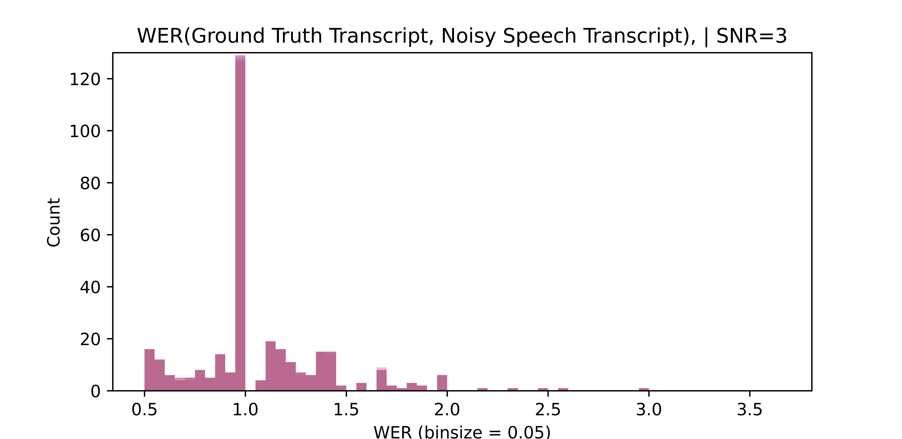
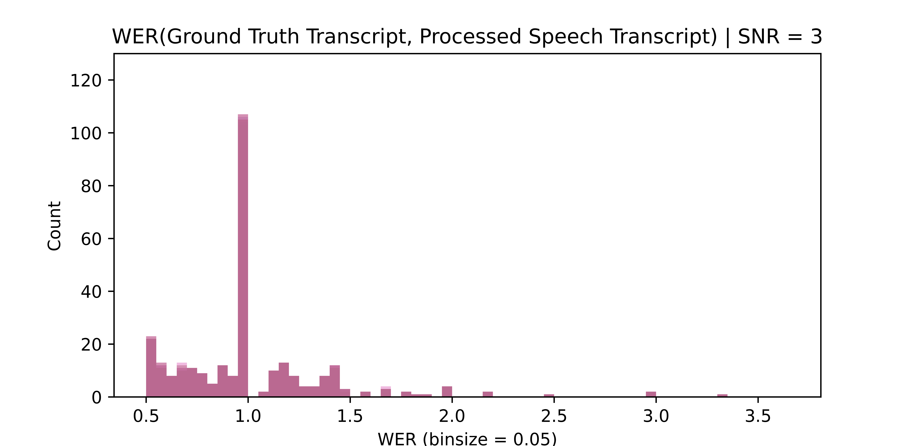
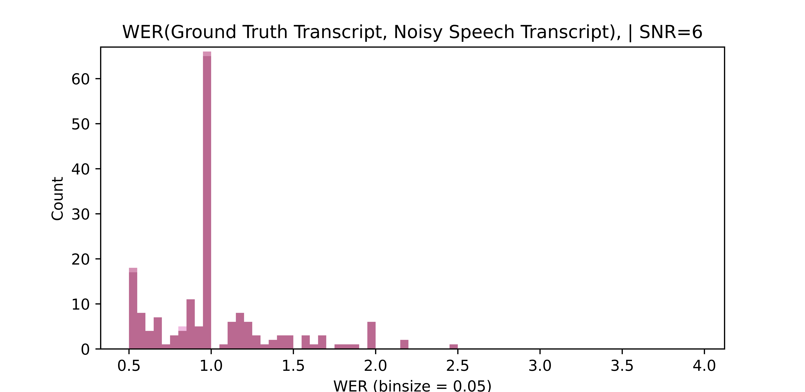
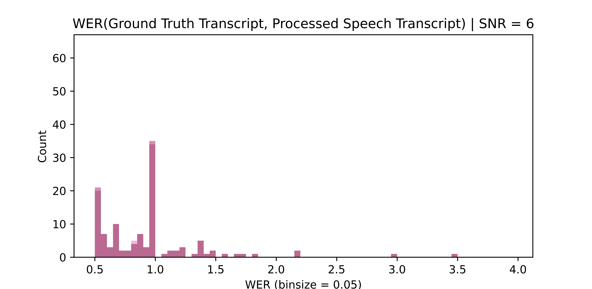
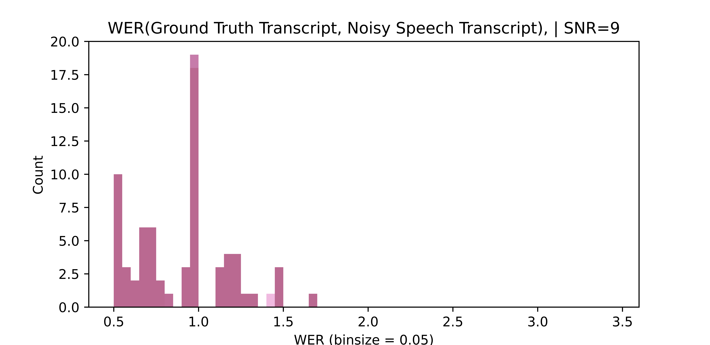
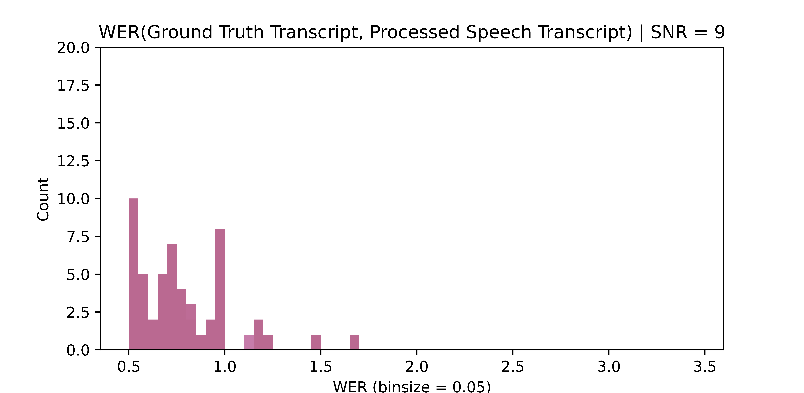

# Speech Enhancement for Robust Automatic Speech Recognition 


## Overview
In this project, we present a audio-enhancement model to improve transcription accuracy in audio-inputs containing multiple speakers.  We train a U-Net network with a custom composite loss-function in an adversarial training paradigm, to suppress lower-volume speakers and maintain higher-volume speakers when fed inputs containing overlapped speech. We present the improvements in the ASR systems with the addition of this model in the processing pipeline.

## Setup

### Dataset Setup
The dataset must be present locally. And the training and inference script will run as long as the absolute path to the training-directory and test-directory are explicitly provided in *fFetchListOfTrainTestFiles()*. 

### Conda Setup
First recreate the conda environment using 
```
conda env create -f environment.yml
```

### Whisper Setup
The ASR system we're using for this project is Whisper \cite{whisper}. When we're instantiating the model, in addition to choosing the model, we also get to decide where the model must be saved. It is good practice to explicitly choose where the models are saved as this enables successul troubleshooting and project-moving. 

So in the section of the code where we're instantiating the Whisper model, please ensure to provide the absolute path to where you wish the model to be saved, using the argument *download_root*. 

### Data-save Path
As the training progresses, we save a number of python objects. This enables us to "check in" and assess the trajectory of our training. This is especially useful when the code is being run on a headless server or through batchjobs. To enable this, we also need to provide the paths where these must be saved. 

So to ensure this goes as expected, please edit the entries to the variables,

- **modelDirectoryPath**: Path to directory where trained models are saved. 
- **directory_to_save_figures**: Path to directory where plots are saved. 
- **directory_to_save_audio**: Path to directory where sample audios are saved.
- **directory_to_save_data**: Path to directory where pickle-data is saved. 

<!-- =================================================== -->
<!-- =================================================== -->
<!-- =================================================== -->
<!-- =================================================== -->
<!-- =================================================== -->
<!-- =================================================== -->
<!-- =================================================== -->
<!-- =================================================== -->
<!-- =================================================== -->
<!-- =================================================== -->
<!-- =================================================== -->
<!-- =================================================== -->
## Scripts

### Training
In this script, we initialize the architecture with random weights and start training the network using the adversarial framework. Step through the following to train a new network

- Please follow the steps outlined in the earlier parts of this section. 
- Run the code 
    ```
    python asr_enhancer_train.py
    ```


### Inference
This script is to primarily take an existing input-audio, process it, save the output-audio and print the transcript for the input and the processed. Step through the following steps to run the script

- Follow the steps outlined in the setup. 
- Run the following code from terminal: \verb|python asr_enhancer_read_process_write.py|. 
    ```
    python asr_enhancer_demo.py
    ```

### Demo
This script is primarily for demonstration. It randomly creates a two-speech audio with the required SNR, processes it and saves the audio and produces transcripts. To run this script, step through the following

- First, please follow the steps in the earlier parts of this section. 
- Place the trained models somewhere locally, ideally in the project directory. If not available, please download from [here](https://github.com/vrsreeganesh/asr-enhancer/tree/main/Weights)
- In the inference, code, assign the path to the variable, **modelMagnitude_path**.
- Run the code from terminal using: 
    ```
    python asr_enhancer_demo.py
    ```


## Results


### Outlier Reduction
<p float="left" style="width: 100%; display: flex; justify-content: space-between;">
  
  
</p>

<p float="left" style="width: 100%; display: flex; justify-content: space-between;">
  
  
</p>


<p float="left" style="width: 100%; display: flex; justify-content: space-between;">
  
  
</p>

The above figures shows the number of outliers before and after processing with our pipeline. An outlier is defined as those signals that have a word-error-rate greater than 50\%. From the figures, the first observation is that the number of outliers have gone down by a significant number. And more importantly, we see that the outliers have moved closer to the lower WER. 

### Average WER Improvement
The following presents average WER before processing, after processing and the improvements provided by the model. The average word-error-rates are presented for the four biggest models: Large, Turbo, Medium and Small. As expected we notice that the error rates are smallest for the largest models and largest for the smaller models. After our processing, we see that there is an average improvement of 6.7\% at SNR = 3, 4.2\% at SNR=6, 1.37\% at SNR=9. 


<div style="display: flex; justify-content: space-between;">

<div style="width: 45%;">

**Large**
| **SNR** | **Noisy** | **Processed** | **Δ WER** |
|---------|-----------|---------------|-----------|
| 3       | 24.1%     | 17.3%         | 6.8%      |
| 6       | 13.9%     | 9.3%          | 4.6%      |
| 9       | 7.1%      | 6.1%          | 1.0%      |
</div>

<div style="width: 45%;">

**Turbo**
| **SNR** | **Noisy** | **Processed** | **Δ WER** |
|---------|-----------|---------------|-----------|
| 3       | 27.88%    | 20.24%        | 7.64%     |
| 6       | 14.52%    | 10.34%        | 4.18%     |
| 9       | 7.79%     | 6.26%         | 1.53%     |
</div>

</div>


<div style="display: flex; justify-content: space-between;">

<div style="width: 45%;">

**Medium**
| **SNR** | **Noisy** | **Processed** | **Δ WER** |
|---------|-----------|---------------|-----------|
| 3       | 30.21%    | 23.72%        | 6.49%     |
| 6       | 15.57%    | 11.77%        | 3.80%     |
| 9       | 10.13%    | 8.61%         | 1.52%     |
</div>

<div style="width: 45%;">

**Small**
| **SNR** | **Noisy** | **Processed** | **Δ WER** |
|---------|-----------|---------------|-----------|
| 3       | 34.40%    | 28.54%        | 5.85%     |
| 6       | 20.73%    | 16.50%        | 4.23%     |
| 9       | 13.96%    | 12.5%         | 1.46%     |
</div>

</div>
